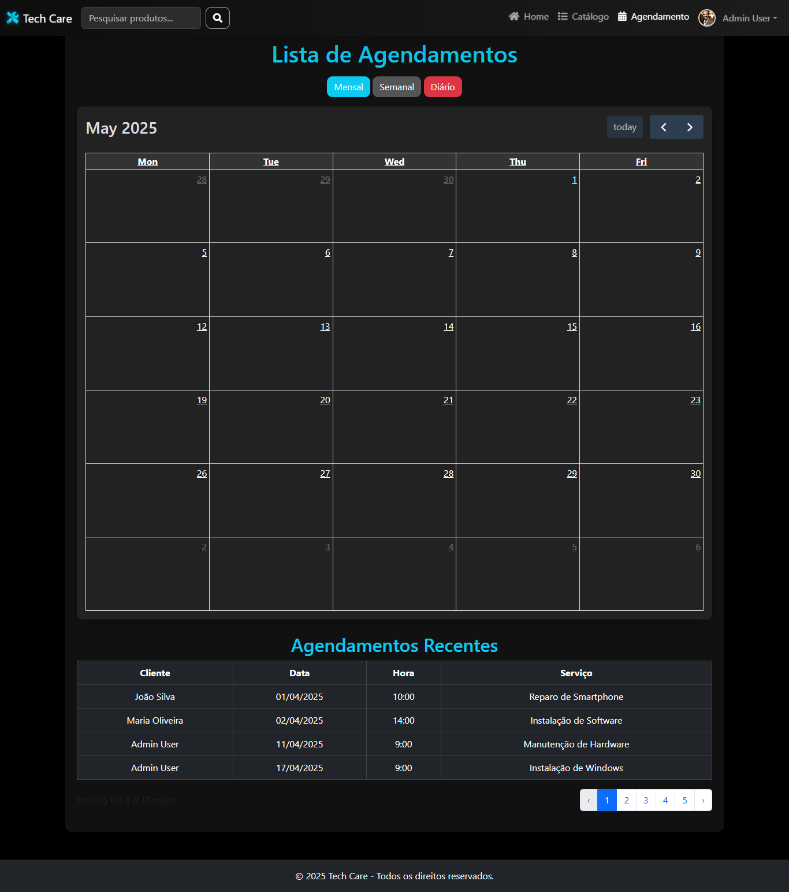
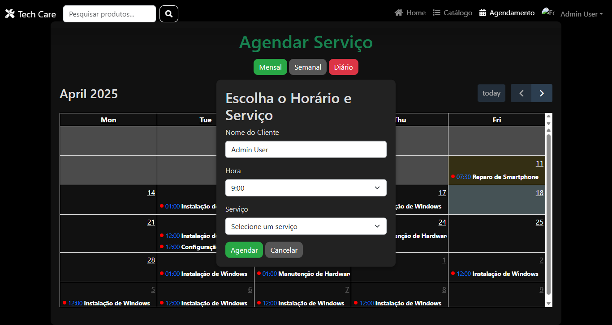
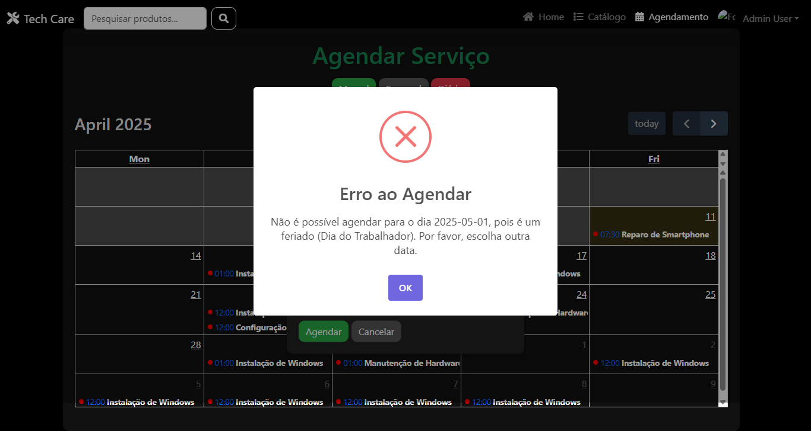
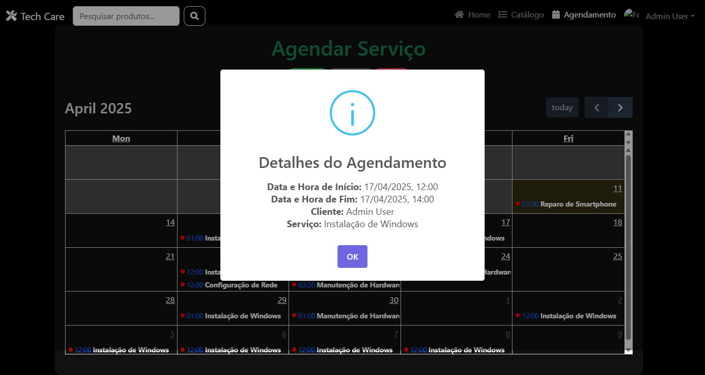
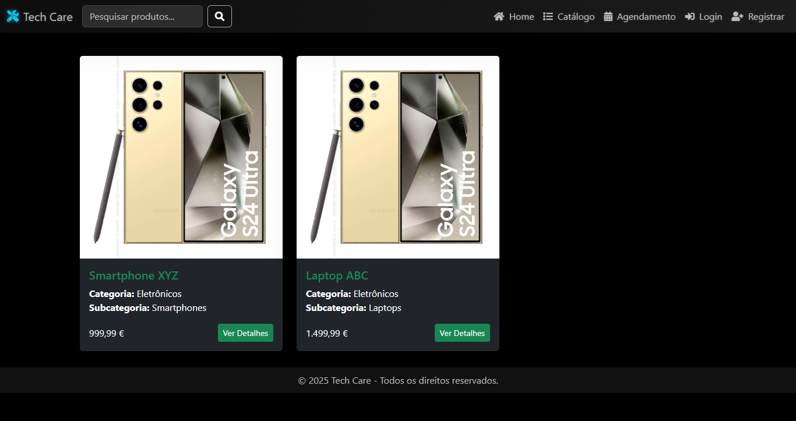
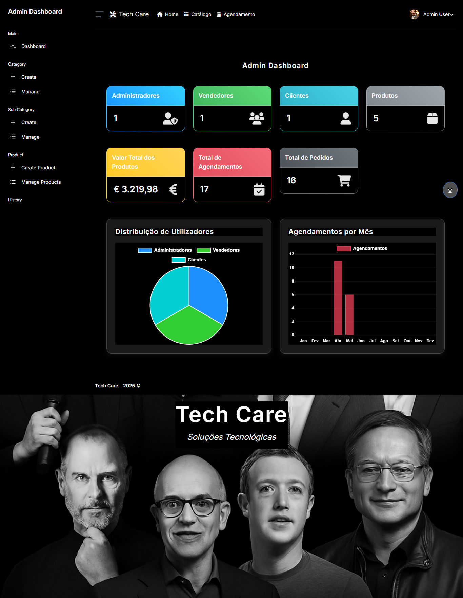

# Tech Care

````markdown
# Tech Care - Sistema de Agendamento e Administração de Serviços

_Sistema de agendamento e administração de serviços técnicos..._


O **Tech Care** é uma aplicação web moderna e eficiente, desenvolvida para facilitar o agendamento e administração de serviços técnicos, como instalação de sistemas operacionais, manutenção de hardware e configuração de redes.

Com uma interface intuitiva e funcionalidades robustas, o Tech Care é ideal para empresas ou profissionais que desejam organizar os seus agendamentos de forma prática e confiável.

Desenvolvido com o framework **Laravel** e integrado ao **FullCalendar**, o Tech Care oferece uma experiência visual atraente e interativa, com suporte a múltiplos papéis de utilizador, validação de feriados e notificações dinâmicas. Este projeto é open-source e colaborativo, convidando desenvolvedores a contribuir para o seu crescimento.

---

## ✨ Funcionalidades Principais

- **Agendamento de Serviços**: Interface interativa com FullCalendar para selecionar datas e horários, com validação de feriados e horários ocupados.
- **Administração de Utilizadores**: Suporte a papéis (admin, vendor, customer) com autenticação e autorização via Laravel Breeze.
- **Notificações Dinâmicas**: Popups com SweetAlert2 para feedback em tempo real (ex.: erro ao agendar em feriado).
- **Catálogo de Produtos**: Secção para busca e exibição de produtos (em desenvolvimento).
- **Interface Amigável**: Design responsivo com Bootstrap 5 e FullCalendar, optimizado para desktops e dispositivos móveis.

---

## 📸 Demonstração do Sistema

Abaixo estão capturas de ecrã que ilustram as principais funcionalidades do Tech Care.

### 1. Página Inicial - Lista de Agendamentos


_Visualize todos os agendamentos no calendário e na tabela de agendamentos recentes._

### 2. Criação de Agendamento


_Seleccione a data, horário e serviço para agendar um atendimento._

### 3. Validação de Feriados


_Notificação de erro ao tentar agendar em um feriado (ex.: Dia do Trabalhador)._

### 4. Detalhes do Agendamento


_Visualize os detalhes de um agendamento existente._

### 5. Catálogo de Produtos (Em Desenvolvimento)


_Busque e visualize produtos (funcionalidade em desenvolvimento)._

### 6. Admin Dashboard


_Visualize o Admin-dashboard._

---

## 🛠️ Tecnologias Utilizadas

- **Backend**: Laravel 10.x
- **Frontend**: HTML, CSS, JavaScript
- **Frameworks e Bibliotecas**:
    - Bootstrap 5
    - FullCalendar 6.1.11
    - Livewire
    - SweetAlert2
    - Luxon
- **Base de Dados**: MySQL
- **Ambiente de Desenvolvimento**: Laragon (recomendado), compatível com XAMPP, WAMP ou Docker

---

## 📂 Estrutura do Projeto

- `app/`: Controladores, modelos e middlewares.
- `app/Http/Controllers/AgendamentoController.php`: Lógica de agendamentos.
- `app/Models/Agendamento.php`, `Order.php`: Modelos principais.
- `resources/views/`: Templates Blade.
- `agendamento/create.blade.php`, `agendamento/index.blade.php`
- `database/migrations/`: Definições das tabelas.
- `routes/web.php`: Rotas da aplicação.
- `public/`: Ficheiros estáticos.
- `screenshots/`: Pasta para imagens do README.

---

## 🚀 Como Começar

### Pré-requisitos

- Git
- PHP 8.1+
- Composer
- Node.js e NPM (opcional)
- MySQL
- VS Code ou similar

### Passos para Configuração

1. Clone o Repositório:
    ```bash
    git clone https://github.com/smpsandro1239/techcare.git
    cd techcare
    ```
````

1. Instale as Dependências:

    ```bash
    composer install
    npm install && npm run dev
    ```

1. Configure o `.env`:

    ```bash
    cp .env.example .env
    php artisan key:generate
    ```

    Edite:

    ```env
    APP_NAME="Tech Care"
    DB_DATABASE=techcare_db
    DB_USERNAME=root
    DB_PASSWORD=
    APP_TIMEZONE=Europe/Lisbon
    ```

1. Configure a Base de Dados:

    ```bash
    php artisan migrate
    php artisan db:seed
    ```

1. Inicie o Servidor:

    ```bash
    php artisan serve
    ```

1. Autenticação Inicial:

    ```bash
    php artisan tinker
    User::create(['name' => 'Admin', 'email' => 'admin@techcare.com', 'password' => bcrypt('password'), 'role' => 1])
    ```

---

## 📖 Como Usar o Tech Care

### 1. Criar um Agendamento

1. Vá para `/agendamento`
1. Clique em uma data no calendário
1. Preencha os campos e clique em "Agendar"

### 2. Visualizar Agendamentos

- Use o calendário interativo
- Clique para ver detalhes do evento
- Veja a lista de agendamentos recentes

### 3. Gerir Utilizadores

- Use a área de administração (se implementada)

---

## 🤝 Como Contribuir

### Estratégia de Branches

- `main`: versão estável
- `feature/*`: novas funcionalidades
- `fix/*`: correções

### Passos

1. Crie uma branch:

    ```bash
    git checkout -b feature/nova-funcionalidade
    ```

1. Faça commit:

    ```bash
    git add .
    git commit -m "feat: adiciona nova funcionalidade"
    ```

1. Push:

    ```bash
    git push origin feature/nova-funcionalidade
    ```

1. Abra um Pull Request no GitHub

---

## ⚠️ Problemas Conhecidos

- Erro 500 no modal de agendamento (em correção)
- Catálogo incompleto
- Verifique o fuso horário (`Europe/Lisbon`) no `.env` e MySQL

---

## 🚀 Contribuições Futuras

- Integração com Stripe ou PayPal
- Notificações por e-mail
- Melhorias visuais
- API REST

---

## 📜 Guia de Estilo

### PHP

- PSR-12
- Nomes descritivos
- Comentários úteis

### JavaScript

- camelCase
- Comentários explicativos

### Commits

- `feat`: nova funcionalidade
- `fix`: correção
- `docs`: documentação

---

## ❓ FAQ

**1. Por que o calendário não carrega os eventos?**
Verifique o método `getAgendamentos`, console do navegador e base de dados.

**2. Como configurar o fuso horário?**
No `.env`:
`APP_TIMEZONE=Europe/Lisbon`
No MySQL:

```sql
SET GLOBAL time_zone = 'Europe/Lisbon';
```

**3. Posso usar outro banco de dados?**
Sim! Laravel suporta PostgreSQL, SQLite, etc.

---

## 📬 Contacto

- **Autor**: Sandro Pereira
- **E-mail**: [smpsandro1239@gmail.com](mailto:smpsandro1239@gmail.com)
- **GitHub**: [https://github.com/smpsandro1239/techcare](https://github.com/smpsandro1239/techcare)
- **LinkedIn**: [https://www.linkedin.com/in/sandro-pereira-1239/](https://www.linkedin.com/in/sandro-pereira-1239/)

- **Autor**: Santiago Rodriguez
- **E-mail**: [Santiagob3rnal@gmail.com](mailto:Santiagob3rnal@gmail.com)
- **GitHub**: [https://github.com/santiagob3rnal](https://github.com/santiagob3rnal)
- **LinkedIn**: [https://www.linkedin.com/in/santiago-bernal-](https://www.linkedin.com/in/santiago-bernal-)

---

## 📄 Licença

Este projeto está licenciado sob a [Licença MIT](LICENSE).

---

## 📸 Instruções para Adicionar Imagens

1. Crie a pasta `screenshots/`
1. Salve as imagens:
    - `lista-agendamentos.png`
    - `modal-agendamento.png`
    - `popup-feriado.png`
    - `detalhes-agendamento.png`
    - `catalogo-produtos.png`
    - `banner-techcare.png`
1. Use os caminhos corretamente no README
1. Faça commit:
    ```bash
    git add screenshots/*
    git commit -m "docs: adiciona imagens ao README"
    git push origin main
    ```

---

Aproveite o **Tech Care**! 🚀

```

---
## 📚 Referências
- [Laravel](https://laravel.com/docs/9.x/database)
- [FullCalendar](https://fullcalendar.io/)
- [Bootstrap](https://getbootstrap.com/)
- [Font Awesome](https://fontawesome.com/)
- [Materialize](https://materializecss.com/)
- [Mysql](https://www.mysql.com/)
- [PhpMyAdmin](https://www.phpmyadmin.net/)
- [XAMPP](https://www.apachefriends.org/pt_br/index.html)
- [Git](https://git-scm.com/)
- [GitHub](https://github.com/)
- [Visual Studio Code](https://code.visualstudio.com/)
- [IntelliJ IDEA](https://www.jetbrains.com/idea/)
- [Postman](https://www.postman.com/)
- [Loragon](https://laragon.org/)
```
